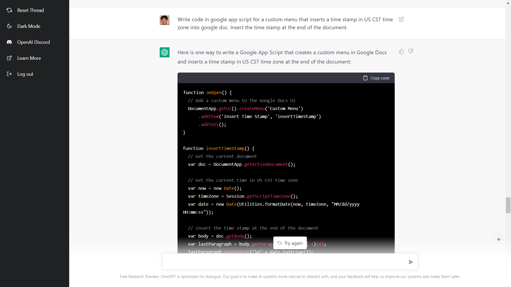

# chatgpt-fun

## News

* 12/07/2022: Casual dialog session log added: [dialogs.md](dialogs.md) 
* 12/06/2022: repo created, and populated with programs.

## Dialogs 

These are some dialogs with ChatGPT: [dialogs.md](dialogs.md)

## ChatGPT prompts and programs generated by ChatGPT (OpenAI)

Just for fun!

I got OpenAI's ChatGPT to generate some short and useful programs. The prompt used are included at the top of each program.

* [gaussian.py](gaussian.py) : animated sampling from 2D normal distribution
* [gaussian2.py](gaussian2.py) : same as above, but closer to what I intended
* [pickpixek.py](pickpixel.py) : click on image and report pixel coordinate
* [timestamp.gs](timestamp.gs) : Google doc app script to insert timestamp into the document.

Here's an example:

Enjoy!
