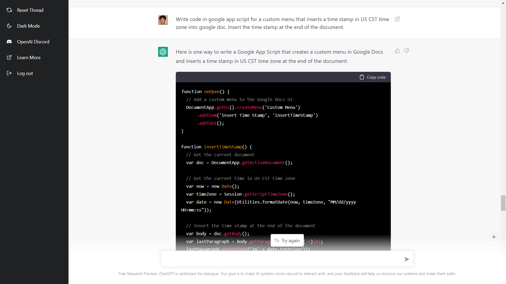
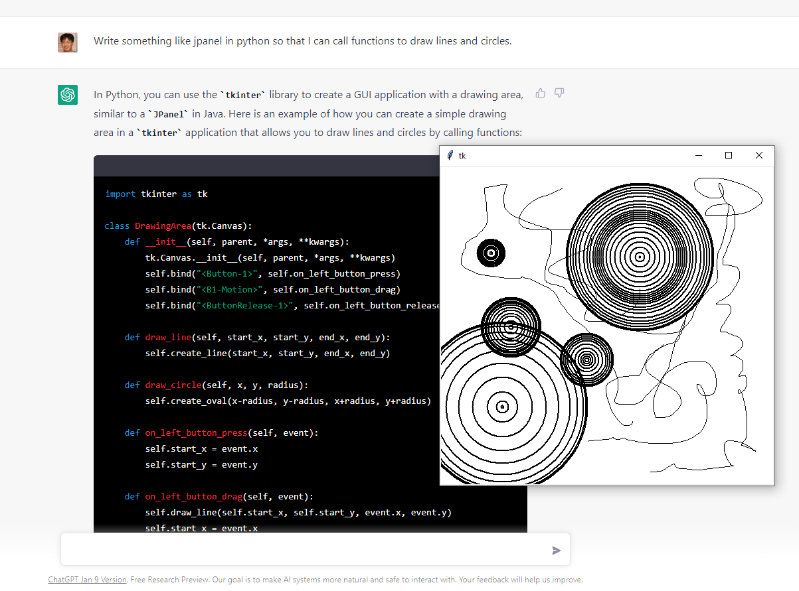

# chatgpt-fun

This is a series of interactions with OpenAI's ChatGPT [http://chat.openai.com](http://chat.openai.com). You need a login ID (you can use your google ID to create one).

## News

* 01/27/2023: Drawing app: [draw.py](draw.py)
* 12/29/2022: Timer app: [timer4.py](timer4.py)
* 12/13/2022: Failure cases: [failures.md](failures.md)
* 12/09/2022: Short stories: [stories.md](stories.md)
* 12/08/2022: Conversation session dump generation (HTML, MD): [session-dump-howto.md](session-dump-howto.md)
* 12/07/2022: Casual dialog session log added: [dialogs.md](dialogs.md) 
* 12/06/2022: repo created, and populated with programs.

## Dialogs 

These are some dialogs with ChatGPT: [dialogs.md](dialogs.md)

## Stories

Here are some short stories: [stories.md](stories.md)

## Failures

These are some failures of ChatGPT: [failures.md](failures.md)

## Generating session dump in HTML or Github MD

You can have ChatGPT to generate a session dump of your conversation in HTML or Github MD format. 
* [session-dump-howto.md](session-dump-howto.md)

## ChatGPT prompts and programs generated by ChatGPT (OpenAI)

Just for fun!

I got OpenAI's ChatGPT to generate some short and useful programs. The prompt used are included at the top of each program.

* [gaussian.py](gaussian.py) : animated sampling from 2D normal distribution
* [gaussian2.py](gaussian2.py) : same as above, but closer to what I intended
* [pickpixel.py](pickpixel.py) : click on image and report pixel coordinate
* [timestamp.gs](timestamp.gs) : Google doc app script to insert timestamp into the document.
* [timer.py](timer.py) : Timer app (incorrect 1st try)
* [timer2.py](timer2.py) : Timer app (correct but lacking features)
* [timer3.py](timer3.py) : Timer app (close to complete)
* [timer4.py](timer4.py) : Timer app (final, with manual edits)
* [draw.py](draw.py) : Free drawing app

Here's an example:

Enjoy!
